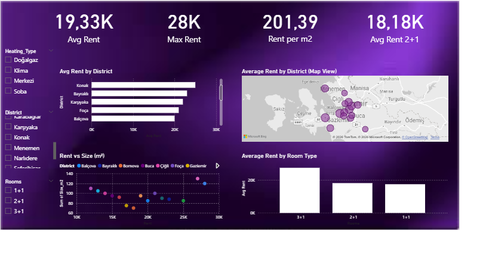
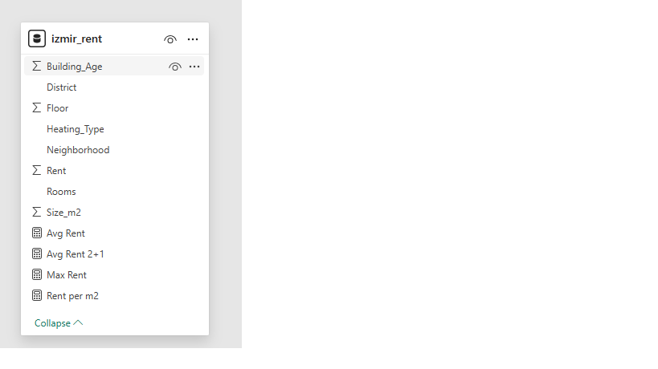

### İzmir Kira Analizi Dashboard (Power BI)

Bu proje, İzmir’deki kira fiyatlarını analiz etmek amacıyla Power BI kullanılarak geliştirilmiş kapsamlı bir veri analizi çalışmasıdır.
Projede, farklı ilçelere, oda tiplerine ve metrekareye göre kira dağılımları incelenmiş ve anlamlı içgörüler elde edilmiştir.

## Dashboard 

-KPI kartları ile ortalama ve maksimum kira analizi

-İlçelere göre kira dağılımı (Bar Chart)

-Metrekare ve kira ilişkisi (Scatter Plot)

-Oda tipine göre kira analizi (Column Chart)

-Harita üzerinden lokasyon bazlı kira dağılımı

## Data Model

-Tek tablo üzerinden veri analizi

-Temiz ve sade veri modeli

-Analiz odaklı veri yapısı

### Veri Seti

Proje kapsamında kullanılan veri seti manuel olarak oluşturulmuş ve analiz için optimize edilmiştir.

## İçerdiği alanlar:

District (İlçe)

Neighborhood (Mahalle)

Rent (Kira)

Rooms (Oda Sayısı)

Size_m2 (Metrekare)

Building_Age

Floor

Heating_Type

### DAX Measure’lar

Average Rent = AVERAGE(izmir_rent[Rent])

Max Rent = MAX(izmir_rent[Rent])

Rent per m2 = DIVIDE(AVERAGE(izmir_rent[Rent]), AVERAGE(izmir_rent[Size_m2]))

Avg Rent 2+1 =
CALCULATE(
[Average Rent],
izmir_rent[Rooms] = "2+1"
)

### Görselleştirmeler

KPI Kartları: Ortalama Kira, Maksimum Kira, m² Başına Kira

Bar Chart: İlçeye Göre Ortalama Kira

Scatter Plot: Kira vs Metrekare

Column Chart: Oda Tipine Göre Kira

Map: İlçeye Göre Kira Dağılımı

Slicer: İlçe, Oda Sayısı, Isınma Tipi

### Projenin Amacı

Gerçek hayat problemine veri analizi ile yaklaşmak

Power BI ile dashboard geliştirme becerisini göstermek

Veri üzerinden anlamlı içgörüler üretmek

### Öne Çıkan Beceriler

Power BI Dashboard Development

DAX ile hesaplama oluşturma

Veri görselleştirme teknikleri

Veri analizi ve yorumlama

### Elde Edilen İçgörüler

İzmir’de kira fiyatları ilçelere göre önemli farklılıklar göstermektedir

Sahil bölgelerine yakın ilçelerde kira seviyeleri daha yüksektir

Metrekare arttıkça kira fiyatı artış göstermektedir

2+1 daireler piyasada en yaygın segmenttir

Eski binalarda kira fiyatları daha düşük seviyededir

### Izmir Rent Analysis Dashboard (Power BI)

This project is a comprehensive data analysis study developed using Power BI to analyze rental prices in Izmir. 
The analysis focuses on rent distribution across districts, room types, and property sizes to generate meaningful insights.

### Dashboard

-KPI cards for average and maximum rent analysis

-Rent distribution by district (Bar Chart)

-Relationship between size and rent (Scatter Plot)

-Rent analysis by room type (Column Chart)

-Location-based rent visualization using map

### Data Model

-Single table data model

-Clean and simple structure

-Analysis-focused design

### Dataset

The dataset used in this project was manually created and optimized for analysis.

Includes:

District

Neighborhood

Rent

Rooms

Size (m²)

Building Age

Floor

Heating Type

### DAX Measures

Average Rent = AVERAGE(izmir_rent[Rent])

Max Rent = MAX(izmir_rent[Rent])

Rent per m2 = DIVIDE(AVERAGE(izmir_rent[Rent]), AVERAGE(izmir_rent[Size_m2]))

Avg Rent 2+1 =
CALCULATE(
[Average Rent],
izmir_rent[Rooms] = "2+1"
)

### Visualizations

KPI Cards: Average Rent, Maximum Rent, Rent per m²

Bar Chart: Average Rent by District

Scatter Plot: Rent vs Size

Column Chart: Rent by Room Type

Map: Rent distribution by district

Slicers: District, Rooms, Heating Type

### Purpose

Solve a real-world problem using data analysis

Demonstrate Power BI dashboard skills

Generate actionable insights from data

### Skills Highlighted

Power BI
DAX
Data Visualization
Data Analysis

### Key Insights

Rent prices vary significantly across districts in Izmir
Coastal districts tend to have higher rent levels
Larger properties generally have higher rent
2+1 apartments dominate the market
Older buildings tend to have lower rent prices

